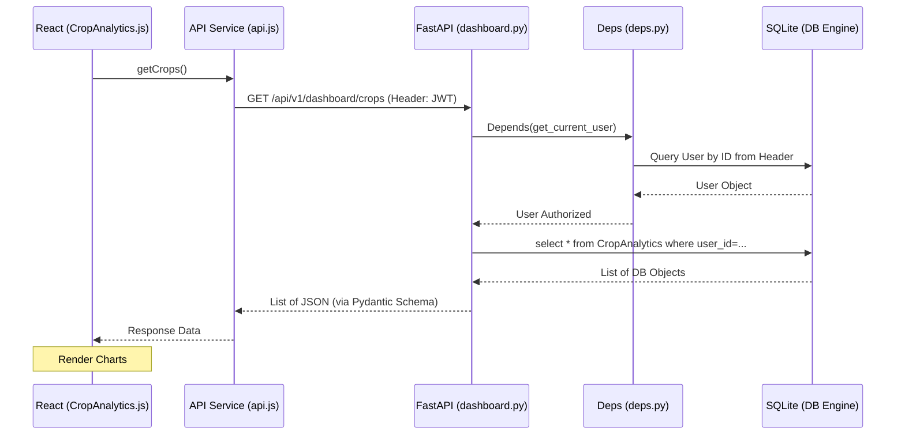

# 🌐 Complete System Architecture & Deep Connectivity

This document provides an exhaustive map of how the Agrowise full-stack application functions, detailing every file's role and its connections across the stack.

---

## ⚓ 1. The Core Infrastructure (Backend Context)

The backend is built on **FastAPI** using a **layered dependency injection** pattern. This ensures that every request has exactly what it needs (Database session, Authentication) before the logic even executes.

### 💉 Dependency Injection (`backend/app/api/deps.py`)
This is the "glue" of the backend. 
- **`get_db`**: Injected into almost every endpoint. It opens a SQLModel `Session`, provides it to the function, and ensures it's closed after the response.
- **`get_current_user`**: The gatekeeper for protected routes. It uses `reusable_oauth2` (OAuth2PasswordBearer) to extract the JWT from the header, validates it via `jose.jwt`, and fetches the user from the DB.

### 🛡 Security Context (`backend/app/core/`)
- **`security.py`**: Contains `create_access_token` and `get_password_hash`. It sits between the User model and the Login endpoint.
- **`config.py`**: Uses `pydantic-settings` to load `.env` variables. It provides the `SECRET_KEY` used by `security.py` and `deps.py`.

---

## 🔁 2. Full-Stack Data Lifecycle (The "When & How")

When a user interacts with the UI, data travels through a specific "Connection Chain".

### 🔑 Authentication Flow (The First Connection)
1. **Trigger**: User enters credentials in `AuthPage.js`.
2. **Action**: `AuthPage.js` calls `authService.login(email, password)` in `src/services/api.js`.
3. **Transport**: Axios sends a `POST` to `/api/v1/login/access-token`.
4. **Backend Logic**: `backend/app/api/v1/endpoints/login.py` receives credentials.
5. **Validation**: It checks the password hash in the `User` model via `security.py`.
6. **Token Issuance**: If valid, it returns a JWT.
7. **Storage**: `api.js` (Interceptors) saves the token to `localStorage`.

### 📊 Dashboard Flow (Requesting Data)
| UI Component | Frontend Service | Backend Route | DB Model | Purpose |
| :--- | :--- | :--- | :--- | :--- |
| `Dashboard.js` | `getSummary()` | `/dashboard/summary` | `Crop`, `Soil`, `Irrigation` | Aggregates all stats for the landing view. |
| `CropAnalytics.js` | `getCrops()` | `/dashboard/crops` | `CropAnalytics` | Fetches historical and predicted yield. |
| `SoilManagement.js` | `getSoil()` | `/dashboard/soil` | `SoilHealth` | Retrieves NPK levels and pH data. |
| `FarmEquipment.js` | `getEquipment()` | `/extended/equipment` | `FarmEquipment` | Tracks maintenance and fuel status. |

---

## � 3. Folder-by-Folder Connectivity Map

Each folder contains files that work in a "Unit". Here is how they connect internally:

### � `backend/app/models/` ↔ `backend/app/schemas/`
- **Relationship**: 1-to-N.
- **`models/*.py`**: Define the physical database structure (SQL Tables).
- **`schemas/*.py`**: Define multiple "Views" of that data (e.g., `UserCreate` has a password, but `UserRead` does not).
- **Connection**: Endpoints use `response_model=schemas.X` for the model to automatically convert DB objects into clean JSON.

### 📁 `backend/app/api/v1/`
- **`api.py`**: The "Traffic Controller". It imports all endpoint files and gives them prefixes (e.g., `/users`, `/dashboard`).
- **`endpoints/*.py`**: The "Brain". This is where the actual code lives. It calls `deps.py` to get the DB and User, then performs the operation.

### � `src/services/` (The Frontend Mirror)
- **`api.js`**: Replicates the backend structure. 
    - `authService` reflects `endpoints/login.py` + `endpoints/users.py`.
    - `dashboardService` reflects `endpoints/dashboard.py`.
    - `extendedService` reflects `endpoints/extended.py`.

---

## 🛠 4. Database Lifecycle & Migrations

The connection between the code and the database is managed by **Alembic**:
1. **Model Change**: You edit a file in `backend/app/models/`.
2. **Detection**: Alembic compares the Python classes to the `sql_app.db` schema.
3. **Migration**: `alembic revision --autogenerate` creates a script in `backend/alembic/versions/`.
4. **Consistency**: Running `alembic upgrade head` ensures the frontend receives data that matches the new structure.

---

## � 5. Connection Visualizer

---
*This document is the authoritative guide for Agrowise developers to understand the interplay between system layers.*
